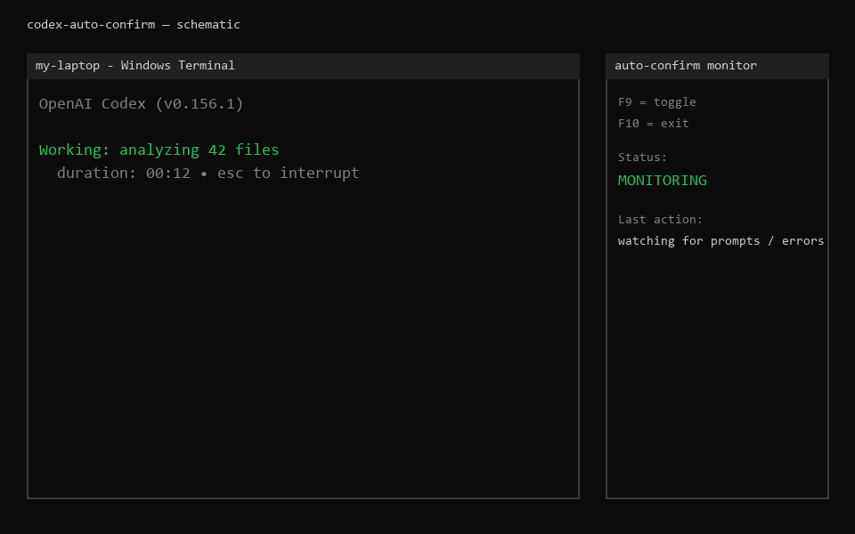

# codex-auto-confirm


A Windows watchdog for **OpenAI Codex CLI** that automatically presses
<kbd>Enter</kbd> on permission prompts and self-heals transient runtime errors
— without ever stealing your focus.

> **Tested on:** Windows Terminal + `codex-cli` 0.156.x. The code also ships a
> CDP path aimed at the Codex Desktop "Allow once" dialog, but the author has
> only run the CLI flow end-to-end; the desktop path is included as-is and is
> community-tested at best.



> Stop babysitting Codex: let it ask "Yes, proceed?" while you keep working in
> another window. When it hits a `429 Too Many Requests`, `502/503/504`, a model
> capacity error, or a dropped stream, the monitor types `继续执行` / continues
> for you and waits for the authoritative `Working …` status before it considers
> the loop recovered.

---

## Why

Codex CLI (≥ 0.15.x) periodically interrupts a long session to:

1. Ask for permission before running a command or applying edits
   (`Would you like to run the following command?` → `Yes, proceed`).
2. Surface transient errors that a single "continue" clears —
   `429 Too Many Requests`, `model at capacity`, `502/503/504 Bad Gateway`,
   `stream disconnected before completion`.

Leaving Codex unattended means it stalls until you come back. This tool watches
every Windows Terminal / ConPTY window that hosts Codex and presses the right
key at the right moment, using **background `PostMessage` delivery** — it never
calls `SetForegroundWindow`, `SetFocus`, or global `SendInput`, so it will not
yank focus away from whatever you are doing.

## Features

- **One-shot approval auto-confirm** for the inline TUI menus
  (`Yes, proceed` / `Yes, just this once`) — the primary, author-tested path.
- **Error self-recovery**: on a visible `429` / `5xx` / capacity / stream-error
  line it posts `继续执行` + <kbd>Enter</kbd>, then waits for an authoritative
  `Working (… • esc to interrupt)` or `Compacting context (…)` status before
  re-arming. Stale transcript lines and historical errors are ignored.
- **Multi-window aware**: each terminal HWND is tracked independently.
- **Focus-safe**: keyboard input is delivered with `PostMessageW` /
  `WM_CHAR` directly to the terminal's `InputSite`; the foreground window stays
  yours.
- **Edge-triggered**: a prompt is confirmed exactly once until it clears.
- **Single-instance**: a named Windows mutex prevents duplicate monitors.
- **Supervised restart**: the `.bat` launcher restarts the Python monitor after
  a crash, but respects a clean <kbd>F10</kbd> exit.
- **No screenshots, no OCR**: it reads the terminal through the native Windows
  UIA TextPattern API, so it works on any DPI / font size.
- **Multi-language recovery**: detects Chinese vs English Codex UI and sends
  `继续执行` or `continue` accordingly (override with
  `CODEX_AUTO_CONFIRM_RECOVERY_TEXT`).
- **System tray**: green/grey icon shows ON/OFF; right-click to toggle, enable
  Windows startup, or quit.
- **(Untested) Codex Desktop "Allow once" via CDP** — code included, not
  verified by the author. See the Safety notes before relying on it.

## Requirements

- Windows 10 / 11 (64-bit)
- Windows Terminal (for the TUI approval path); the ConPTY fallback also works

## Install — easiest (EXE)

Download `codex-auto-confirm.exe` from the
[latest release](https://github.com/NJCN-AXIO/codex-auto-confirm/releases/latest)
and double-click it. A small green icon appears in the system tray; that's it.
No Python install required.

Right-click the tray icon to toggle auto-confirm, enable/disable Windows
startup, or quit.

## Install — from source

```powershell
git clone https://github.com/NJCN-AXIO/codex-auto-confirm.git
cd codex-auto-confirm
pip install -r requirements.txt
```

The UIA reader ships as a small PowerShell script
(`scripts/codex_terminal_uia_reader.ps1`) — no extra install needed, it is
launched on demand by the Python monitor.

## Run

Console mode (with visible log window):

```powershell
python scripts\codex_auto_confirm.py
```

Tray mode (no console window):

```powershell
python scripts\codex_auto_confirm.py --tray
```

You should see:

```
=======================================================
  Codex CLI Auto Confirm
  Codex: found
  Trigger title: action required
  Auto Confirm: ON
  F9=toggle  F10=exit
=======================================================
```

Start Codex in a Windows Terminal window as usual. Leave this monitor running in
the background.

## Hotkeys

| Key | Action |
|-----|--------|
| <kbd>F9</kbd> | Toggle auto-confirm on / off (also resets the recovery latch) |
| <kbd>F10</kbd> | Exit cleanly (the `.bat` supervisor will **not** restart a clean exit) |

In tray mode, the same toggle is also available from the right-click menu.

## Configuration

All tuning is via environment variables — no config file to edit.

| Variable | Default | Purpose |
|----------|---------|---------|
| `CODEX_AUTO_CONFIRM_TITLE` | `codex` | Window-title fragment used by the legacy title-based finder. |
| `CODEX_AUTO_CONFIRM_ACTION_TITLE` | `Action Required` | Legacy title that signals a pending approval. |
| `CODEX_AUTO_CONFIRM_PROCESS_NAMES` | `WindowsTerminal.exe,conhost.exe,codex.exe` | Process names eligible for Codex-terminal detection. |
| `CODEX_AUTO_CONFIRM_CDP_PORT` | `27374` | Local CDP port used for the Codex Desktop "Allow once" dialog. |
| `CODEX_AUTO_CONFIRM_RECOVERY_TEXT` | _(auto)_ | Pin the exact "continue" command sent after a recoverable error. Default: auto-detect Chinese vs English. |
| `CODEX_AUTO_CONFIRM_RECOVERY_POLL_SECONDS` | `0.25` | How often the UIA scanner wakes up. |
| `CODEX_AUTO_CONFIRM_SCAN_TIMEOUT_SECONDS` | `1.5` | Timeout for one in-flight UIA scan. |
| `CODEX_AUTO_CONFIRM_CONFIRMATION_TIMEOUT_SECONDS` | `5.0` | How long a posted "continue" waits for an authoritative `Working` status before re-arming. |
| `CODEX_AUTO_CONFIRM_SEMANTIC_RETRY_SECONDS` | `0.8` | Repeat interval while the same visible error has no `Working` status yet. |
| `CODEX_AUTO_CONFIRM_POWERSHELL` | `powershell.exe` | Path to the PowerShell executable used for the UIA helper. |

See [`docs/RUNBOOK.md`](docs/RUNBOOK.md) for the full list and the exact
error signatures that trigger recovery.

## Safety notes

- This tool sends <kbd>Enter</kbd> (and, for the Chinese locale, the four
  characters `继续执行`) **only** after the current UIA/CDP read proves a real
  one-shot approval or a known transient error is on screen. It does **not**
  infer completion from a window title or a generic substring.
- Deny / reject menus, "always allow" options, quoted examples inside the
  transcript, and historical error lines all fail closed — no keypress is sent.
- It intentionally does **not** read passwords or type into any field that is
  not a Codex approval / error prompt.
- Still, run it only on machines and sessions you control.

## Troubleshooting

| Symptom | Fix |
|---|---|
| Console says `Codex: not found` | Start Codex in a **Windows Terminal** window first. The watchdog only detects ConPTY / Windows Terminal hosting `codex`. |
| Prompt appears but no auto-confirm | Press <kbd>F9</kbd> to make sure auto-confirm is `ON`; check the tray icon colour. |
| Tray icon doesn't appear on first run | The EXE starts minimized to tray. Look in the overflow chevron (the `^` on the taskbar) and drag the icon out if you want it pinned. |
| Nothing happens on a `429` / `503` | Your Codex UI may be in a language other than English/Chinese. Set `CODEX_AUTO_CONFIRM_RECOVERY_TEXT` to the exact "continue" command your Codex expects. |
| I want to see what it is doing | Open `%APPDATA%\codex-auto-confirm\watchdog.log`, or right-click the tray icon → **Open log folder**. |
| It keeps relaunching after I close it | You ran `codex_auto_confirm.bat`, which is a supervised launcher. Press <kbd>F10</kbd> inside the console for a clean exit, or close the window and wait 2 s — the bat will restart it; press Ctrl+C in the console instead to stop the loop. |
| `Another monitor is already running` | A previous instance (or tray) is still alive. Right-click its tray icon → Exit, or kill `codex-auto-confirm.exe` in Task Manager. |

## Uninstall

Run `scripts\uninstall.bat` (or, for the EXE, right-click and Run as
administrator is **not** needed — everything is per-user). It will:

1. Remove the `CodexAutoConfirm` Windows autostart entry.
2. Terminate any running `codex-auto-confirm.exe`.

Then delete the EXE / source folder you downloaded. Logs stay at
`%APPDATA%\codex-auto-confirm\`; delete that folder manually for a full clean.

## Development

Run the regression suite (no real Codex window needed — everything is mocked):

```powershell
python -m pytest scripts\ -q
```

A read-only live probe (prints the currently visible Codex snapshots, sends
nothing):

```powershell
python -c "import importlib.util,time; \
p=r'scripts\codex_auto_confirm.py'; \
s=importlib.util.spec_from_file_location('m',p); m=importlib.util.module_from_spec(s); s.loader.exec_module(m); \
r=m.CodexTerminalReader(); r.request_scan(); time.sleep(1); \
v=r.poll(); print([(x.get('title'), x.get('hwnd')) for x in (v or []) if m.eligible_codex_snapshot(x)]); r.close()"
```

## Project layout

```
codex-auto-confirm/
├── scripts/
│   ├── codex_auto_confirm.py          # The watchdog (main entry point)
│   ├── codex_terminal_uia_reader.ps1  # UIA TextPattern reader (child process)
│   ├── tray.py                       # System-tray UI (pystray)
│   ├── autostart.py                  # Windows Run-key startup toggle
│   ├── codex_auto_confirm.bat        # Supervised launcher / restart loop
│   ├── uninstall.bat                 # Remove autostart + kill running EXE
│   ├── test_codex_auto_confirm.py
│   ├── test_codex_auto_confirm_guards.py
│   ├── test_codex_auto_confirm_recovery.py
│   ├── test_codex_auto_confirm_desktop.py
│   └── test_recovery_text.py         # i18n / language detection tests
├── docs/
│   ├── RUNBOOK.md                    # Detailed behavior & tuning reference
│   └── demo.gif                      # Animated schematic
├── pyproject.toml
├── requirements.txt
├── CHANGELOG.md
├── LICENSE                           # MIT
└── README.md
```

## License

[MIT](LICENSE)
